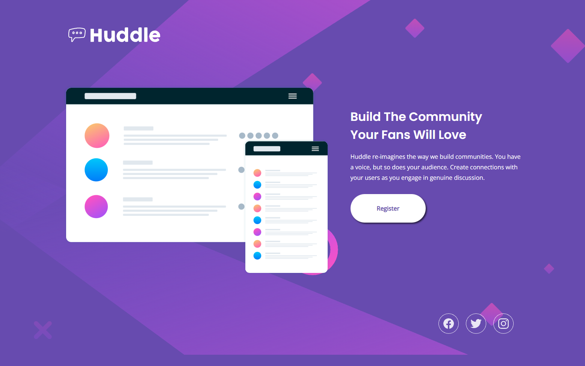

# Frontend Mentor - Huddle landing page with single introductory section solution

This is a solution to the [Huddle landing page with single introductory section challenge on Frontend Mentor](https://www.frontendmentor.io/challenges/huddle-landing-page-with-a-single-introductory-section-B_2Wvxgi0). Frontend Mentor challenges help you improve your coding skills by building realistic projects. 

## Table of contents

- [Overview](#overview)
  - [The challenge](#the-challenge)
  - [Screenshot](#screenshot)
  - [Links](#links)
- [My process](#my-process)
  - [Built with](#built-with)
  - [What I learned](#what-i-learned)
  - [Continued development](#continued-development)
  - [Useful resources](#useful-resources)
- [Author](#author)

## Overview

### The challenge
---
Users should be able to:

- View the optimal layout for the page depending on their device's screen size
- See hover states for all interactive elements on the page

### Screenshot
---


### Links
---
- Solution URL: [Github](https://Github.com/Fqthom/Huddle)
- Live Site URL: [Github Pages](https://Fqthom.Github.io/Huddle)

## My process

My process was a Desktop first approach, utilizing a Flexbox to product the side-by-side layout.

This was the first project that allowed me to gain momentum on my own with little-to-no outside knowledge needed. The only outside research used was for the button transition as talked through below.  This was a huge confidence builder to be able to identify key structures when building a project.

### Built with
---
- Semantic HTML5 markup
- CSS custom properties
- Flexbox

### What I learned
---
My first interactive button with a smooth transition animation.

This was my first challenge with not only setting a transition time, but experimenting with how to transition back to it's original state. The biggest piece of knowledge gained is learning that a transition time can be set to the original state to allow a smooth transition back.


```css
.button:hover  i{
    opacity: 1;
    padding-left: 30px;
    transition: 500ms;
    transition-delay: 500ms;
    position: relative;
}
.button:hover{
    background-color: hsl(300, 69%, 71%);
    width: 90px;
    transition: width 1s;
    display: flex;
    align-items: center;
    justify-content: space-between;
}
```

### Continued development
---
Positions within CSS. The Icon within the button gave issues during transition when returning to it's original state, the icon would appear below the text for a split second. I was able to add a delay to avoid this.

I am still having difficulty with the positions and how they correlate with each other, I end up cycling through them until I discover the one that works best.

### Useful resources
---
- [CSS Transitions Article](https://developer.mozilla.org/en-US/docs/Web/CSS/CSS_Transitions/Using_CSS_transitions)

This article helped explain the difficulty I was having with the button transition, and helped later when it came to the Social Icons.

## Author

- Github - [Github](https://github.com/Fqthom)
- Frontend Mentor - [@Fqthom](https://www.frontendmentor.io/profile/Fqthom)
